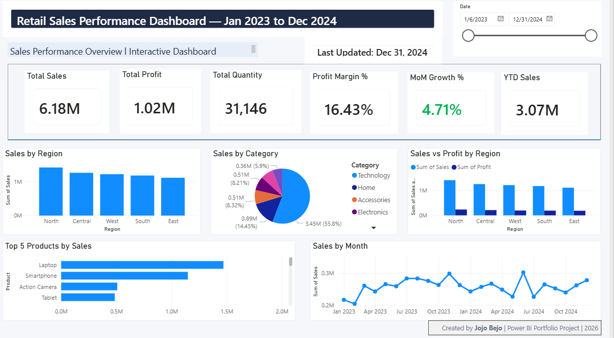

# Retail Sales Performance Dashboard (Power BI)

## 📊 Overview
Interactive dashboard to analyze retail sales across regions, products, and time.

## 🚀 Key Features
- KPIs: Total Sales, Profit, Quantity, Profit Margin %, MoM Growth %, YTD Sales  
- Monthly trend analysis with dynamic date slicer  
- Regional and product performance breakdown  
- Drillthrough to product-level details  
- Conditional formatting for performance insights  

## 🛠 Tools Used
- Power BI  
- DAX  
- Data Modeling  

## 📸 Dashboard Preview

